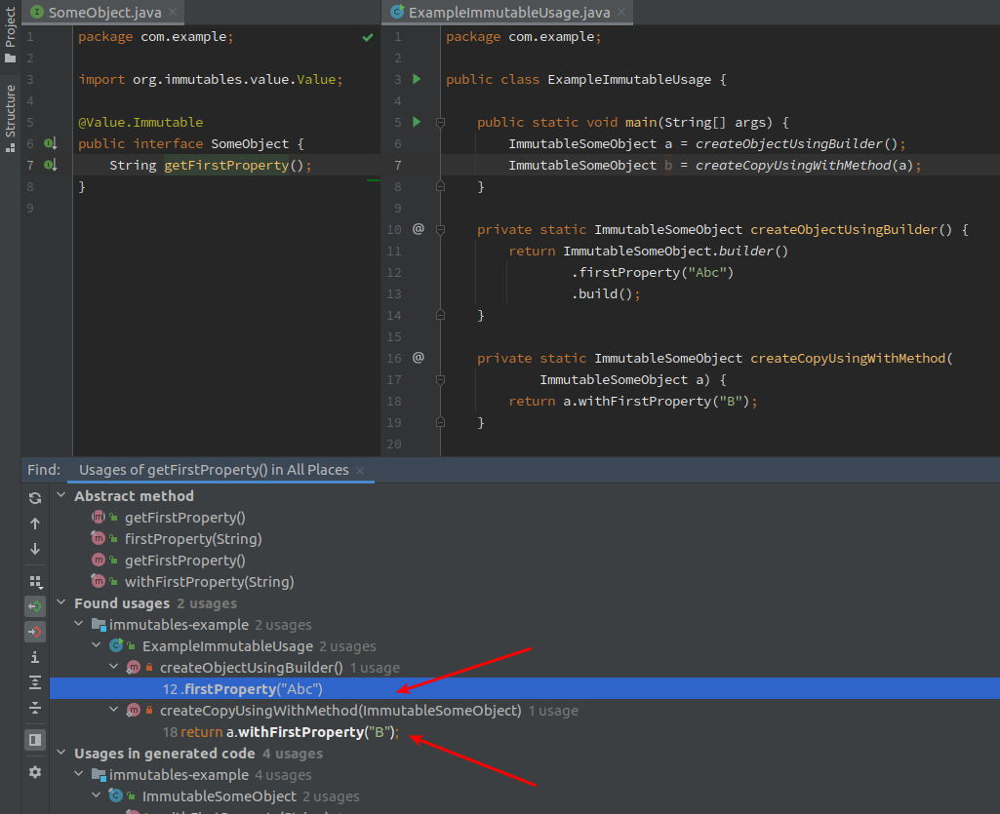

# find-immutables-usages-plugin

## About

<!-- Plugin description -->
This IntelliJ Plugin helps with [immutables.org](http://immutables.github.io/) by extending 'Find Usages' for immutable property getter.

**Note** this is not an official immutables.org plugin (there was no official plugin as of Feb 2021).
<!-- Plugin description end -->

## Installation

- Using IDE built-in plugin system:
  
  <kbd>Settings/Preferences</kbd> > <kbd>Plugins</kbd> > <kbd>Marketplace</kbd> > <kbd>Search for "Immutables.org Support"</kbd> >
  <kbd>Install Plugin</kbd>
  
- Manually:

  Download the [latest release](https://github.com/plaskowski/find-immutables-usages-plugin/releases/latest) and install it manually using
  <kbd>Settings/Preferences</kbd> > <kbd>Plugins</kbd> > <kbd>⚙️</kbd> > <kbd>Install plugin from disk...</kbd>

## Roadmap

- [X] ~~Set the Plugin ID in the above README badges.~~
- [X] ~~Set the [Deployment Token](https://plugins.jetbrains.com/docs/marketplace/plugin-upload.html).~~
- [ ] support other features like:
  - @Builder.Constructor,
  - @Builder.Factory, 
  - @Value.Style
- [ ] support less common cases like:
  - having ``@Value.Immutable`` on interface that extends the public interface (the one containing properties signatures)

## Related resources

- https://github.com/immutables/immutables/issues/904
- com.intellij.find.actions.FindUsagesAction
- https://github.com/mapstruct/mapstruct-idea
- JavaFindUsagesHandler#getSecondaryElements()
- https://plugins.jetbrains.com/docs/intellij/psi-cookbook.html#java-specific
- com.intellij.find.findUsages.CustomUsageSearcher
- https://plugins.jetbrains.com/docs/intellij/find-usages.html
- https://plugins.jetbrains.com/intellij-platform-explorer
- [scala plugin](https://github.com/JetBrains/intellij-scala/blob/3b5c8039c90d315f53a258ca58a3b237949eeebc/scala/scala-impl/resources/META-INF/scala-plugin-common.xml)
- my question on Slack https://jetbrains-platform.slack.com/archives/C5U8BM1MK/p1613464009450100
- [LombokFieldFindUsagesHandlerFactory](https://github.com/mplushnikov/lombok-intellij-plugin/blob/ff0ac206568b3fd2ee238a0b6efed7ae01a3f8bf/src/main/java/de/plushnikov/intellij/plugin/extension/LombokFieldFindUsagesHandlerFactory.java)

---
Plugin based on the [IntelliJ Platform Plugin Template][template].

[template]: https://github.com/JetBrains/intellij-platform-plugin-template
